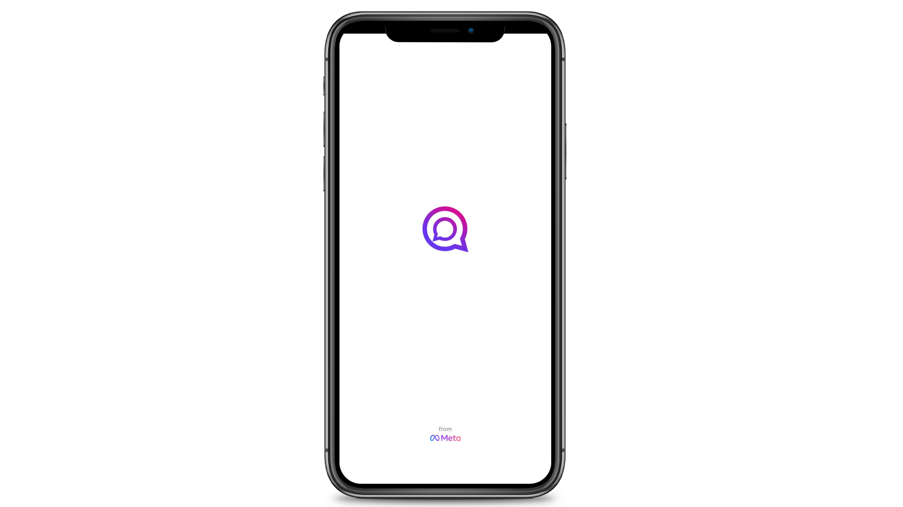
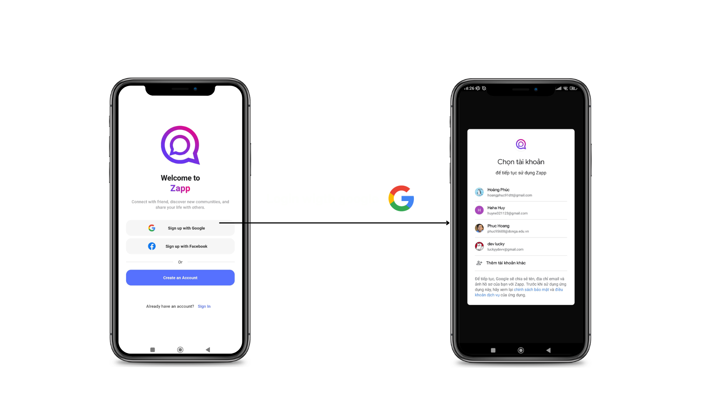
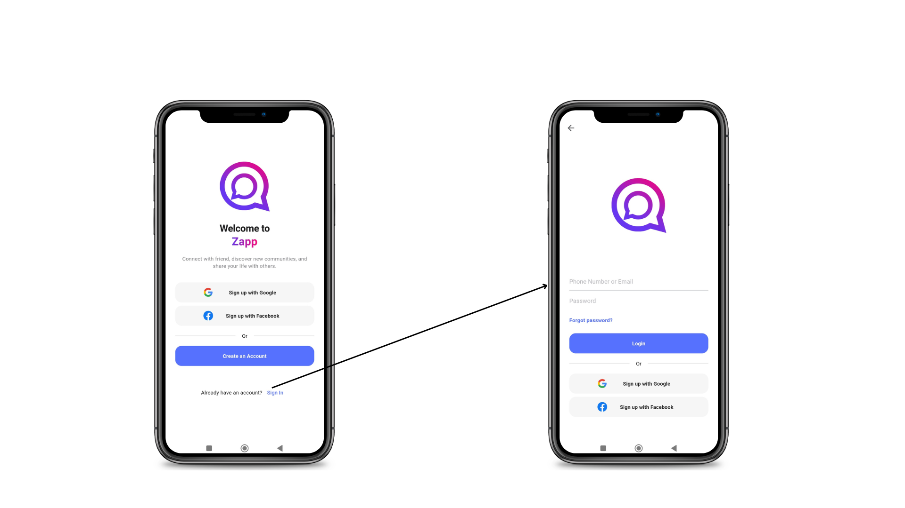
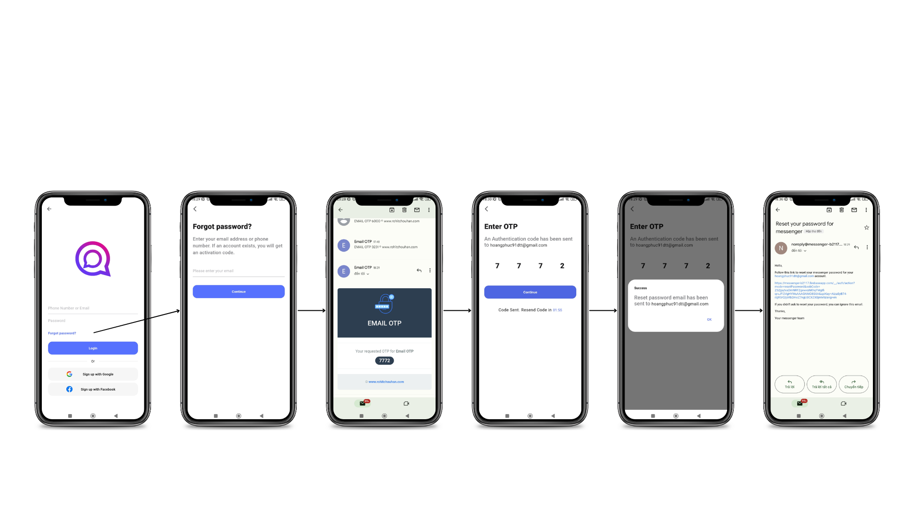
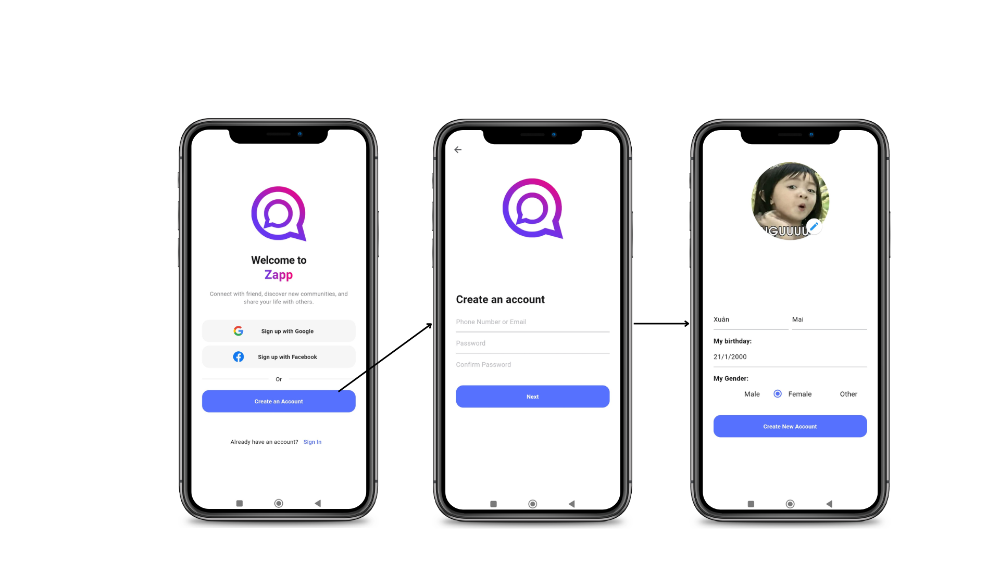
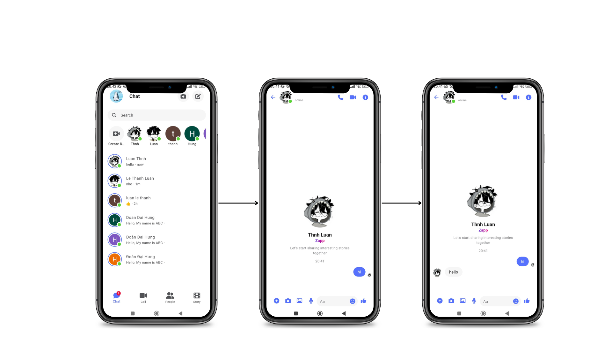
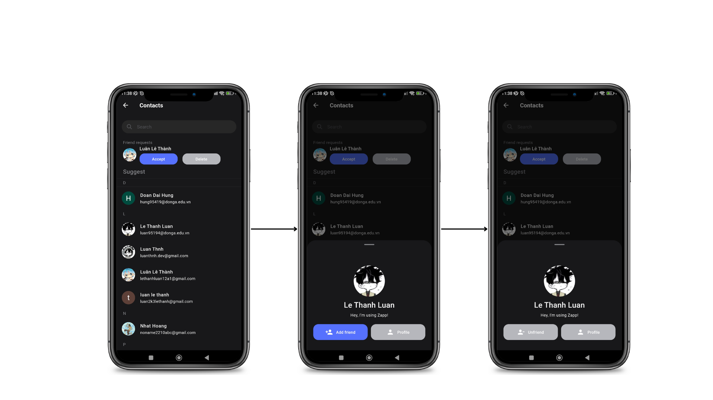
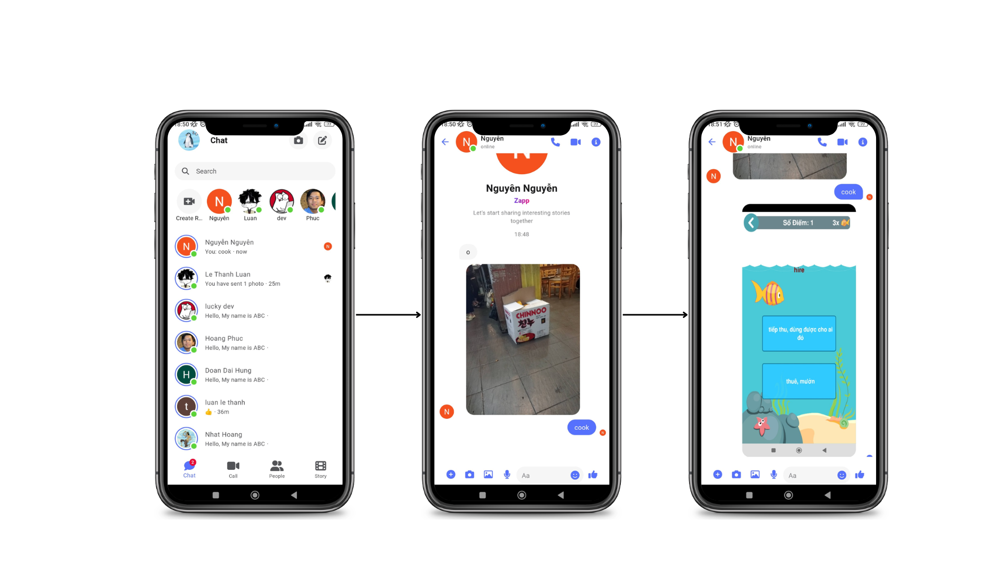
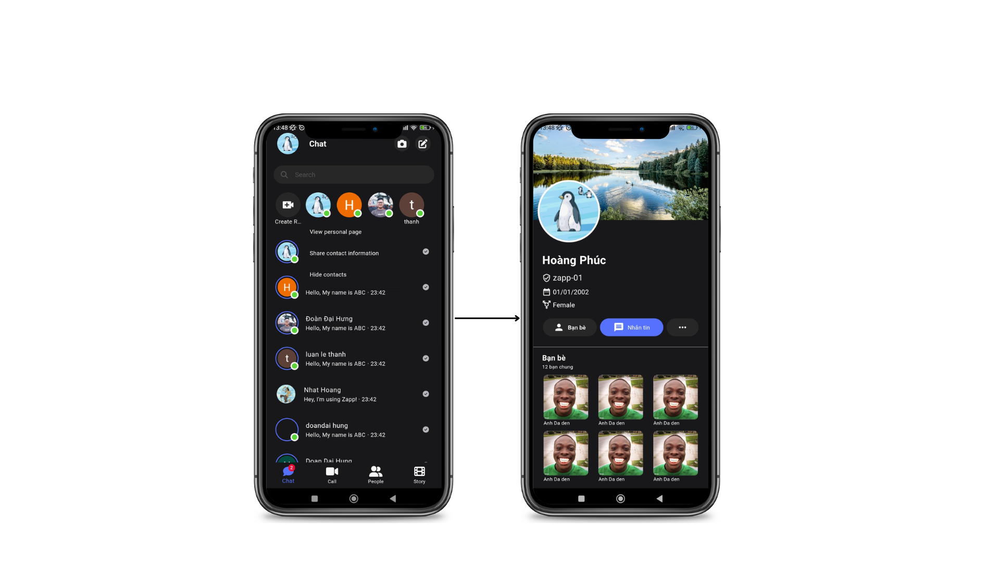
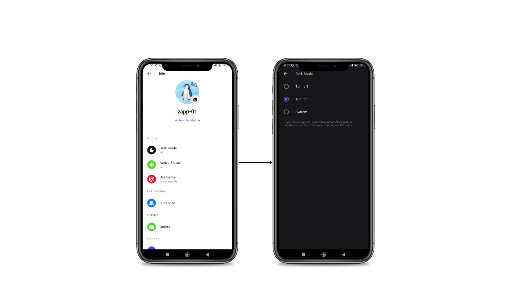

# Zapp App

Clone a messenger app built with Flutter and Dart.

## Table of Contents

- [Zapp App](#zapp-app)
  - [Table of Contents](#table-of-contents)
  - [Introduction](#introduction)
  - [Features](#features)
  - [Getting Started](#getting-started)
    - [Prerequisites](#prerequisites)
    - [Installation](#installation)
  - [Usage](#usage)
  - [Screenshots](#screenshots)
  - [Contributing](#contributing)
  - [License](#license)

## Introduction

This is a simple messaging app built with Flutter and Dart, using Firebase for real-time data synchronization.

## Features

- **User Authentication**: Secure user authentication system.
- **Real-time Messaging**: Instant messaging with real-time updates.
- **User Profiles**: Users can create and customize their profiles.
- **Multimedia Support**: Send and receive text messages, images, and more.
- **Notifications**: Receive push notifications for new messages.

## Getting Started

### Prerequisites

Before you begin, ensure you have Flutter and Dart installed on your machine. If not, follow the official [Flutter installation guide](https://flutter.dev/docs/get-started/install) for your operating system.

### Installation

1. Clone the repository:

```bash
   git clone https://github.com/luan-thnh/zapp-app.git
```

2. Navigate to the project directory:

```bash
   cd zapp-app
```

3. Install dependencies:

```bash
   flutter pub get
```

## Usage

1. Open the project in your preferred Flutter development environment.
2. Run the app on an emulator or connected device:

```bash
   flutter run
```

## Screenshots












1. Explore the app and its features.

## Contributing

This project exists thanks to all the people who contribute.

<a href="https://github.com/luan-thnh">
  
</a>
<a href="https://github.com/hajimemaste">
  
</a>
<a href="https://github.com/hoangphuc91dtt">
  
</a>
<a href="https://github.com/ngoc-huyenn">
  
</a>

## License

This project is licensed under the [MIT License](LICENSE).
